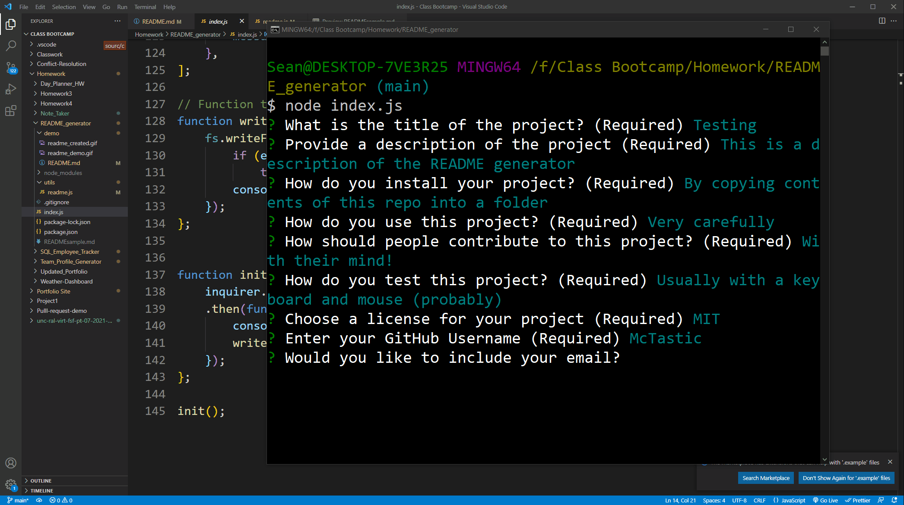

# README Generator

 - [Demo](#demo)
 - [Description](#description)
 - [Installation](#installation)
 - [Usage](#usage)
 - [Additional Info](#additional-info)

    ## Demo:
    
    

    ## Description:
    This is a simple application that runs in a terminal window which will generate a README.md file. The user will be asked a series of questions which will help determine the basic skeleton of the README file and then a markdown file is created once they have finished. 

    ## Installation:
    Once all contents from this repository are downloaded, the user will need to navigate to the folder in their computer through the terminal. Once there, you need to type "npm i" and hit enter to install the necessary packages to run this software. 

    ## Usage:
    To start, navigate to the folder where this appication is saved via the terminal and type "node index.js". This will begin the process of asking various questions which will build the README. Once done, a README.md file will be created in the same directory. 

    ## Additional Info:
    - Github: [Mctastic](https://github.com/mctastic)
    - Email: mctastic2121@gmail.com 